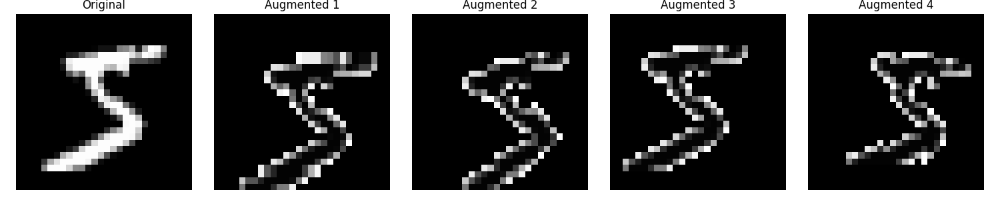

# MNIST Training with Data Augmentation

This project implements a CNN model for MNIST digit classification with data augmentation.

## Data Augmentation Examples

The training process uses the following augmentations:
- Random rotation (up to 10 degrees)
- Random translation (up to 10%)
- Random scaling (90% to 110%)

Here are examples of how these augmentations affect the input images:

The leftmost image shows the original digit, and the following images show different random augmentations applied to the same digit.

## Model Architecture
- Input: 28x28 grayscale images
- 2 Convolutional layers with batch normalization
- ReLU activation
- Max pooling
- Single fully connected layer
- Output: 10 classes (digits 0-9)

## Training
- Single epoch training
- SGD optimizer with momentum
- Custom learning rate scheduling
- Target accuracy: 93%

## Running the Project
1. Install dependencies: